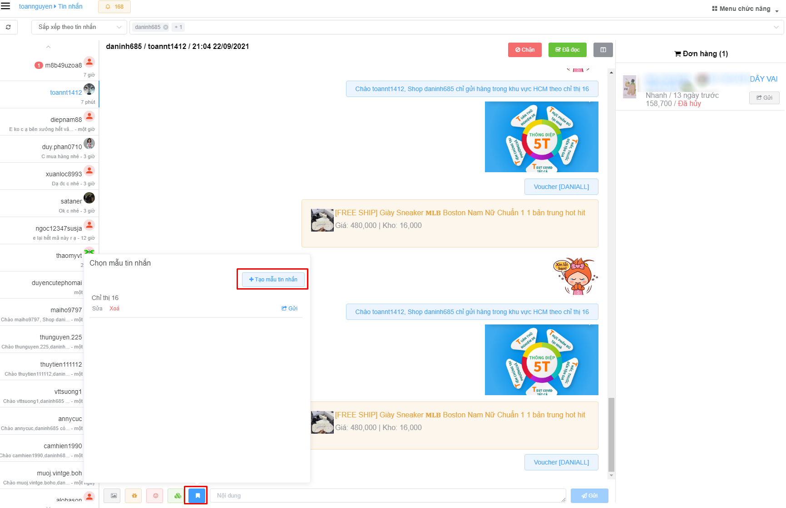
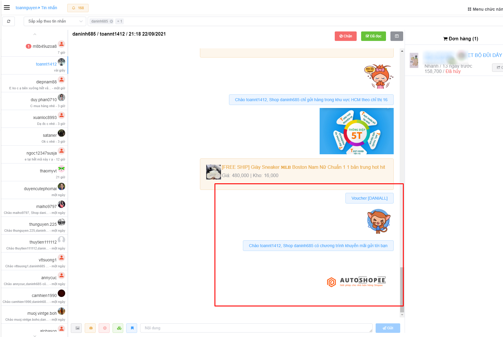

# Chat tập trung

## 1) Mở tin nhắn tập trung

## 2) Xem đơn hàng

## 3) Gửi Voucher, Sticker, Sản phẩm, Hình ảnh

## 4) Mẫu tin nhắn (\*)

> Một tính năng quan trọng giúp bạn tiết kiệm thời gian, lưu lại mẫu tin nhắn tránh việc nhập lại nhiều lần
>
> Mẫu tin nhăn không chi gửi nội dung, mà còn có thể gửi kèm hình ảnh, sticker, voucher, sản phẩm

### a) Tạo mẫu

.jpg>)

.jpg>)

.jpg>)

### b) Gửi mẫu

